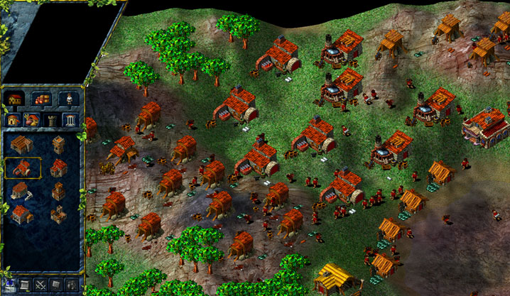

# Migration 

Migration is a Strategy Game
The game is set in a medieval time, controlled via a point and click interface, with the primary goal to build a settlement 
with a functioning economy, producing sufficient units so as to conquer territories, ultimately gaining control of the entire map.

## Screenshots

## Documentation

Migration uses several Delegates and Pointers to Delegates to accomplish its tasks. Basically, a Delegate acts as a handler for events. During Migration game play, the game will determine when to fire off delegates. (i.e., when they will execute). Migration uses threads to accomplish this. Each time through the cycle (i.e., loop) the game determines -using a threshold, if a particular delegate should fire off now or later on. Once the threshold is met during the cycle, a thread will be created and the game continues. Also, note that this new thread may fire other threads, so on, and so forth.

Some delegates need to fire Asynchronously and some Synchronously.

## License

This article, along with any associated source code and files, is licensed under the [BSD 3-clause license].
